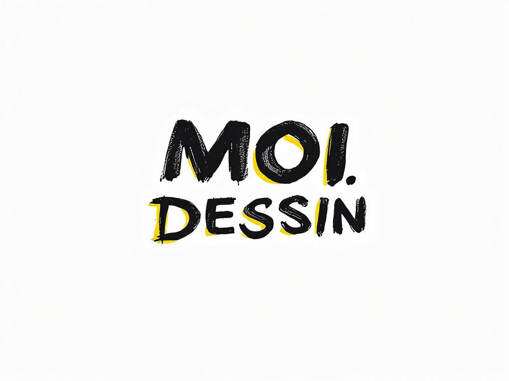

# MOI.DESSIN

Bienvenue sur MOI.DESSIN, une plateforme où je publie mes dessins et ceux de particuliers dans un style similaire à Pinterest.

## Description

MOI.DESSIN est un projet étudiant dédié à la publication et au partage de mes œuvres d'art. En tant qu'étudiant passionné par le dessin, j'ai créé ce site pour explorer et présenter mes créations. Vous pouvez parcourir mes dessins, les aimer, les commenter et les partager avec d'autres amateurs d'art.

Visitez le site ici : [MOI.DESSIN](https://tinx242.github.io/Moi.Dessin/)

## Fonctionnalités

- Publication de dessins et illustrations réalisés dans le cadre de mes études et projets personnels.
- Interface utilisateur intuitive et conviviale, conçue pour faciliter la navigation.
- Possibilité de commenter et d'aimer les publications pour interagir avec la communauté.
- Partage facile sur les réseaux sociaux pour promouvoir mes œuvres.
